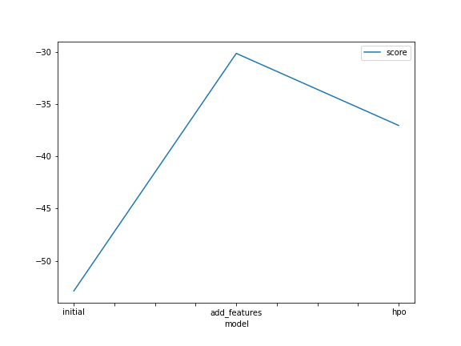
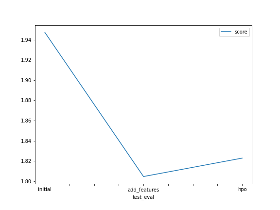

# Report: Predict Bike Sharing Demand with AutoGluon Solution
#### Avi Mukesh

## Initial Training
### What did you realize when you tried to submit your predictions? What changes were needed to the output of the predictor to submit your results?
The project is hinting that I should expect negative values. However, when I describe the table, I see there are no negative values. I've trained each model twice. However, in the case there are negative values, I'm assuming that Kaggle rejects the submission, as it does not make sense to have a negative count of deliveries. I will try training the models again to see if I obtain negative values again, as I could be going awry in my method.

### What was the top ranked model that performed?
In all three cases, the model that performed the best was WeightedEnsemble_L3. This model consistently had the highest score. In all cases, the top 5 also included CatBoost_Bag_L2 and LightGBM_BAG_L2.

## Exploratory data analysis and feature creation
### What did the exploratory analysis find and how did you add additional features?
I found that the histograms for the windspeed and our target feature of "count" had similar-shaped histograms. So I decided to look at the correlations, however, it turns out that the correlation coefficient is only 0.1, not indicative of any correlation. I did find there to be a weak correlation between these pairs: temperature and count, and hour and count.
I added the hour feature as part of the feature engineering stage, by extracting it from the datetime column after converting it to a datetime object. I also added a column for day and a column for month.

### How much better did your model preform after adding additional features and why do you think that is?
The best performing model was still Weighted_Ensemble_L3, however, the performance is better now as the score is higher at -30.15 compared to -52.88. I think this is because of the weak correlation between hour and count, which perhaps the model learnt.

## Hyper parameter tuning
### How much better did your model preform after trying different hyper parameters?
After changing the num_bag_folds to 10, the Kaggle score actually decreased. The evaluation score was now -30.07 (same model). So I changed some other parameters as well - I set num_stack_levels to 10 and num_bag_sets to 2 (keeping 10 num_bag_folds) but in fact got a worse performance, with a larger RMSE on the unseen data. As a final effort, I then also doubled the time limit to 12 minutes, but observed no difference.
After the first review, I changed different hyperparameters, and got a worse evaluation score of -37, but the Kaggle score stayed at 1.82283.

### If you were given more time with this dataset, where do you think you would spend more time?
I would spend more time on the EDA because there are lots of variables to understand first. For example, I would also create extra columns for month and year to see if there are any correlations with these and the delivery count. 

### Create a table with the models you ran, the hyperparameters modified, and the kaggle score.
|model|hpo1|hpo2|hpo3|hpo4|hpo5|score|
|--|--|--|--|--|--|--|
|initial|time_limit|presets|?|?|?|1.9472|
|add_features|time_limit|presets|?|?|?|?|1.80457|
|hpo|time_limit|presets|num_bag_folds|?|?|?|1.80341|
|hpo2|time_limit|presets|num_bag_folds|num_bag_sets|num_stack_levels|?|1.8228|
|hpo3|time_limit=1200|presets|num_bag_folds|num_bag_sets|num_stack_levels|?|1.8228|
|hpo4 (after review)|time_limit=1200|presets|num_epochs|num_trials|scheduler|searcher|1.8228|

### Create a line plot showing the top model score for the three (or more) training runs during the project.

### Create a line plot showing the top kaggle score for the three (or more) prediction submissions during the project.

## Summary
Creating the extra column definitely helped decrease the error on the unseen data. However, changing the hyperparameters from the default ones actually resulted in worse performance. Without further testing different hyperparameters, it is hard to say which ones are important in this scenario and which ones, if changed, would lead to the best performance.
